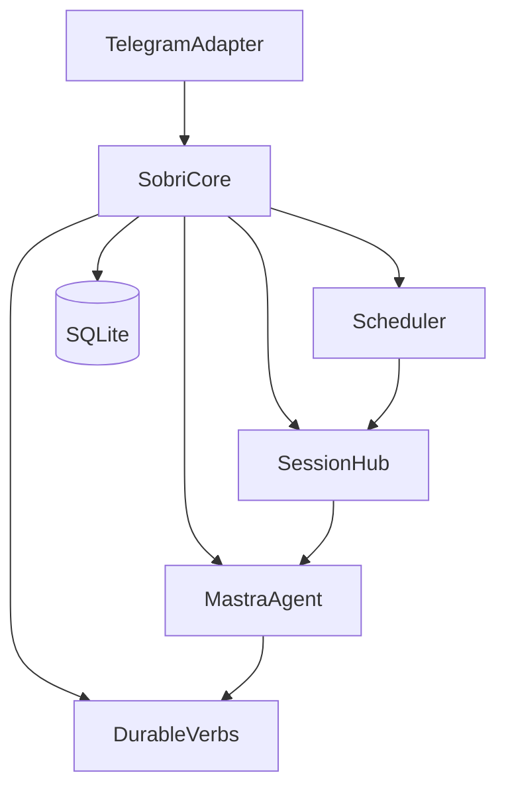

# Architecture (Phase 1)

Product contracts: [`spec/`](../spec/AGENTS.md), glossary [`CONTEXT.md`](../CONTEXT.md), ADRs [`docs/adr/`](../docs/adr/). This doc is **how we build** — not a rewrite of the idea.

Product / agent person: **Sobri**.

## Stack (locked for Phase 1 build)

| Layer | Choice | Role |
|-------|--------|------|
| Language | TypeScript | App and agent logic |
| Runtime / packages | **Bun** workspaces | Install, scripts, tests, local run |
| Agent framework | **Mastra** | Sobri agent, tools, model calls |
| Telegram | **Grammy** | Group channel adapter |
| Persistence | **SQLite** | Durable ledger + chat memory + settings |
| Packages | `@sobri/core`, `@sobri/telegram` | Core domain vs channel I/O |

Deploy shape (Compose / image registry) is decided when ops tickets land — not required to start foundation.

### Models (build-time)

Mastra model router via env. Names only in repo:

| Env | Purpose |
|-----|---------|
| `OPENAI_API_KEY` / `DEEPSEEK_API_KEY` (as used) | Provider keys |
| `MODEL_ID` | Selected model id for the agent |

Ledger fairness and Check-in writes use **durable verbs** — no LLM invents statuses or streak numbers ([spec/stats.md](../spec/stats.md), [spec/agent.md](../spec/agent.md)).

## Tooling (Phase 1 intent)

- `bun run typecheck` — `tsc --noEmit` across workspaces
- `bun run lint` — **oxlint** (wired on [`.scratch/foundation/`](../.scratch/foundation/) T3, resolved)
- Pre-commit hook runs lint + typecheck when hooks land (optional; see foundation T3.3)

Exact oxlint/TypeScript versions and hook path are foundation-board decisions.

## Core vs Telegram adapter

Telegram is a **frontend adapter**. Fairness rules, Day ledger, Checklist, Grace Token (заморозка), Chat Profile / Diary, and Session orchestration live in a **channel-agnostic core**. A future second client (e.g. admin HTTP) calls the same core verbs — it does not become a second product mind.

### `@sobri/core` (channel-agnostic)

- Durable verbs for Check-in, Day close, Checklist, settings, Grace Token, stats reads
- Session hub (`getOrStart(chat)`, idle timeout, turn serialization) — [spec/session.md](../spec/session.md), [ADR 0004](../docs/adr/0004-agentic-session-vs-day.md)
- Scheduler wake points for Reminder and Deadline — [spec/daily-rhythm.md](../spec/daily-rhythm.md)
- Memory store (Profile + Diary markdown) — [spec/memory.md](../spec/memory.md), [ADR 0003](../docs/adr/0003-memory-markdown-and-injection.md)
- Mastra agent placement: Sobri person, tool choice, narration; tools call core verbs
- SQLite ownership and migrations

### `@sobri/telegram` (channel I/O only)

- Grammy bot: group messages, callbacks, `/settings` chrome
- Render `askWithOptions` as inline buttons; enforce caption length limit ([spec/telegram-ux.md](../spec/telegram-ux.md))
- Map Telegram chat/user ids → core chat/member ids
- Outbound formatting / parse mode decisions

### Tool rule

Channel-specific tools are allowed for UX. They must invoke core verbs. Product fairness stays on the core path.

### Phase 1 module layout

One process, Bun workspaces — not microservices:

- `packages/core` — `@sobri/core`
- `packages/telegram` — `@sobri/telegram` (depends on core)

## Session hub

One in-flight **Session** per chat ([ADR 0004](../docs/adr/0004-agentic-session-vs-day.md)):

| Concern | Owner | Notes |
|---------|-------|-------|
| `getOrStart(chat)` | Core Session hub | At most one Session per chat |
| Turn serialization | Core | Mutex / queue per chat — no overlapping generates |
| Idle timeout | Core | Quiet period closes Session; exact minutes on a later board |
| Ephemeral history | Session (RAM) | Lost on process restart |
| Durable state | SQLite via core | Days, Check-ins, Checklist, settings, Profile, Diary survive restart |

Triggers: Telegram events and scheduler events (Reminder, Deadline) each wake a short Session, then idle-close like any other burst ([spec/session.md](../spec/session.md)).

**Session ≠ Day.** A Day is the calendar ledger until Deadline ([ADR 0002](../docs/adr/0002-overnight-deadline-day-key.md)); many Sessions may open/close during one Day.

## Durable verbs vs agent

| Layer | Owns | Must not |
|-------|------|----------|
| **Durable verbs** | Ledger writes/reads: Check-in, late fix, Deadline auto-slip, Grace Token earn/spend/refund, Checklist join/leave, settings, stats derivation | Invent statuses outside rules |
| **Agent (Mastra)** | When to talk, how to phrase, Day resolution questions, Summary tone, memory edit judgment | Bypass verbs; fabricate streak numbers |

Conflict rule from [spec/agent.md](../spec/agent.md): **ledger and tool results win** over narrative preference.

Conceptual capability → mechanism map (build detail on later boards):

| Capability ([agent.md](../spec/agent.md)) | Mechanism |
|------------------------------------------|-----------|
| Remind | Scheduler → Session → agent posts Reminder (`askWithOptions`) |
| Record / correct Check-in | Agent (or button path) → durable Check-in / late-fix verbs |
| Close Day | Scheduler Deadline → auto-slip verbs → Day Summary |
| Ask with options | Core verb + Telegram button chrome |
| Answer progress / full stats | Stats read verbs → agent narrates |
| Recall / update memory | Memory verbs + injection policy ([ADR 0003](../docs/adr/0003-memory-markdown-and-injection.md)) |
| Checklist / settings | Durable verbs; `/settings` via adapter |

## Scheduler (Reminder / Deadline)

Core owns schedule evaluation in chat timezone ([spec/daily-rhythm.md](../spec/daily-rhythm.md)):

1. **Reminder** — wake Session → post Reminder → members Check-in (button or free text)
2. **Deadline** — wake Session → auto-slip silent Checklist (Grace Token rules, [ADR 0001](../docs/adr/0001-grace-token.md)) → Day Summary → Day closed; late fix until next Reminder ([ADR 0005](../docs/adr/0005-late-fix-until-next-reminder.md))

Day key stays the Reminder-cycle evening date when Deadline crosses midnight ([ADR 0002](../docs/adr/0002-overnight-deadline-day-key.md)).

Implementation note for later boards: timer loop vs external cron is an eng choice; product beats stay as above.

## SQLite ownership

| State | Package | Notes |
|-------|---------|-------|
| Connection + migrations | `@sobri/core` | Single writer process assumed in Phase 1 |
| Chat settings (Reminder, Deadline, TZ, N) | Core | Admin-facing via telegram `/settings` |
| Checklist, Days, Check-ins, Grace Token state | Core | Fairness ledger |
| Chat Profile + Diary | Core | Markdown strings ([ADR 0003](../docs/adr/0003-memory-markdown-and-injection.md)) |
| Telegram transport ids | Telegram adapter (+ thin core mapping as needed) | Bridge only |

Profile/Diary **implementation** is Phase 2 ([spec/roadmap.md](../spec/roadmap.md)); core owns placement when that board lands — foundation/core MVP does not ship memory tables.

**Clean slate.** No sushkobot V1 DB import ([spec/roadmap.md](../spec/roadmap.md)).

DB path / data directory via env name (e.g. `DATABASE_PATH`) — values never committed.

## Mastra placement

- Lives inside `@sobri/core` (or a core submodule), not inside the Grammy package
- Agent tools wrap durable verbs and memory/stats reads
- Adapter calls Session hub with inbound events; Session hub drives the agent turn
- Character / prompt material sourced from [spec/character.md](../spec/character.md) (implementation packaging on agent board)

## Env / secrets (names only)

Expected names for Phase 1 (exact set locked on foundation board):

- `TELEGRAM_BOT_TOKEN`
- `MODEL_ID` + provider API key(s)
- `DATABASE_PATH` (or equivalent)
- Bot admin allowlist env (for `/settings` alongside Telegram group admins) — name locked when settings land

No secrets in git. `.env.example` lists names only.

## Out of scope here

- Product rule changes (edit `spec/` / ADRs first)
- Full domain verb implementation (later boards)
- Live Grammy group MVP (telegram board)
- Deploy / GHCR / Compose hardening (ops when needed)
- sushkobot DB import
- Web / admin HTTP client (Phase 4 stewardship)

## Build gate

If product rules change: update `spec/` (and ADRs) first → this doc if architecture shifts → then code. Tickets: [`.scratch/`](../.scratch/), per [`docs/agents/issue-tracker.md`](../docs/agents/issue-tracker.md).
